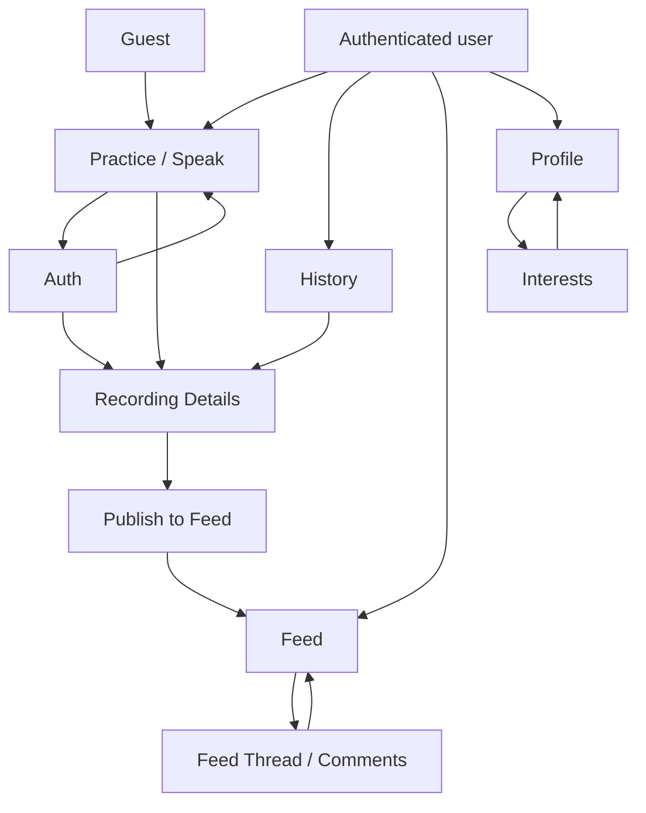
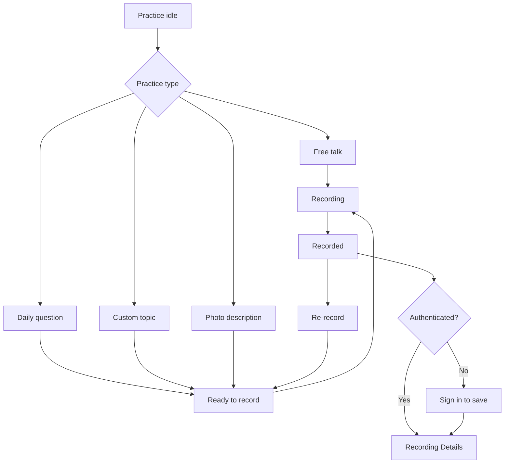
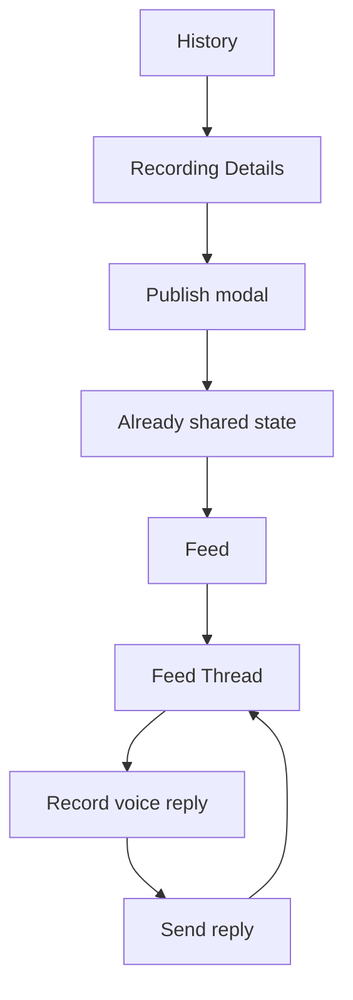
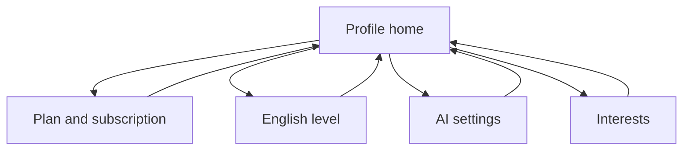

# Daily Speaking Practice: ТЗ и промпт для EA-агента

Этот документ нужен как handoff для агента, который будет делать редизайн приложения. Его можно использовать как README, product brief или прямой промпт для дизайн/implementation агента.

Цель: объяснить, что уже делает проект, какие экраны и состояния есть сейчас, и какой результат нужен от редизайна под мобильный iOS-first интерфейс.

## 1. Короткая суть проекта

Daily Speaking Practice - приложение для ежедневной разговорной практики английского.

Пользователь выбирает формат практики, записывает голос, сохраняет запись, получает транскрипт и AI-рекомендации, а затем может опубликовать запись в общий Feed и получить голосовые комментарии от других пользователей.

Основная ценность продукта:

- быстро начать speaking practice без долгой настройки;
- говорить на тему дня, свою тему, свободно или по фото;
- сохранить запись и вернуться к истории прогресса;
- увидеть транскрипт и подсказки по ошибкам;
- поделиться записью в сообществе и получить voice replies.

Продукт должен ощущаться как спокойный учебный инструмент для регулярной практики, а не как landing page.

## 2. Текущий стек и архитектура

Текущий проект - веб-приложение:

- Next.js App Router;
- React;
- TypeScript;
- Redux Toolkit;
- PostgreSQL-backed auth/data APIs;
- local Ollama для генерации вопросов/guidance/study words;
- local Whisper backend для транскрипции записей.

Приложение работает как SPA внутри одного URL. Экраны переключаются через Redux state `currentScreen`, а не через отдельные browser routes.

Ключевые файлы для анализа:

- `src/components/AppShell.tsx` - глобальный shell, header, tabs, выбор текущего экрана.
- `src/store/slices/appSlice.ts` - все основные screen states, transitions, async actions, auth, quota, feed, profile.
- `src/lib/data.ts` - доменные типы `Recording`, `FeedPost`, `FeedReply`, reactions.
- `src/components/SpeakScreen.tsx` - главный practice/recording flow.
- `src/components/DetailsScreen.tsx` - просмотр записи, transcript, AI suggestions, publish.
- `src/components/FeedScreen.tsx` и `src/components/FeedThreadScreen.tsx` - community feed и voice replies.
- `docs/FUNCTIONAL_REQUIREMENTS_DESIGN.md` - подробная функциональная карта текущей демки.

## 3. Роли пользователей

### Guest

Гость:

- видит только основной экран Practice/Speak;
- может начать запись и дойти до состояния recording complete;
- не может сохранить запись без авторизации;
- при попытке сохранить попадает на Auth в режиме `Sign in to save recording`;
- не видит History и Feed.

### Authenticated Free User

Авторизованный free user:

- видит Practice/Speak, History, Feed, Profile;
- может сохранять записи;
- может открывать историю;
- может публиковать запись в Feed;
- может оставлять voice replies;
- имеет недельный лимит записи 10 минут;
- имеет лимит одной сессии до 10 минут;
- видит usage/remaining quota в профиле и в practice flow.

### Subscriber

Subscriber:

- имеет те же экраны, что free user;
- не ограничен недельным лимитом;
- все равно ограничен 10 минутами на одну recording session;
- видит статус подписки и дату окончания.

## 4. Текущая карта экранов

Текущие screen states из Redux:

- `speak` - главный экран практики;
- `history` - история сохраненных записей;
- `feed` - общий feed опубликованных записей;
- `feedThread` - thread записи с voice replies;
- `details` - детали сохраненной записи;
- `auth` - вход/регистрация;
- `profile` - профиль и настройки;
- `interests` - выбор интересов;
- `share` - legacy preview screen, сейчас не является обязательным активным flow.



## 5. Главные пользовательские flow

### 5.1 Practice and save flow



### 5.2 Review and community flow



### 5.3 Profile flow



## 6. Экран Practice / Speak

Назначение: стартовая точка приложения. Пользователь должен быстро выбрать формат практики и начать говорить.

Текущий функционал:

- Free talk через primary action `Start speaking`.
- Daily questions: генерация 3 вопросов дня, regenerate, loading, empty, error.
- Custom topic: раскрываемое поле, ввод своей темы, cancel/use topic.
- Photo description: upload image, preview, remove image, optional object name, start photo session, validation errors.
- Words for study: генерация 10 слов, contextual text, подсветка study words, loading/empty/error.
- Topic guidance: follow-up questions и useful words для выбранной темы.
- Recording: microphone recording, timer, stop, session limit.
- Recorded: duration, re-record, save/sign in to save, preparing audio, save error.
- Quota handling: free weekly limit, remaining time, session limit.

Состояния, которые нужно покрыть в дизайне:

- idle;
- daily questions loading/ready/empty/error;
- custom topic collapsed/expanded;
- photo not selected/selected/error;
- study words empty/loading/ready/error;
- ready to record;
- recording;
- recorded;
- quota warning;
- quota reached;
- guest save prompt.

## 7. Экран Auth

Назначение: вход и регистрация.

Текущий функционал:

- email/password login;
- account creation;
- loading state;
- auth error;
- back action;
- отдельный режим `Sign in to save recording`, если гость пришел после записи.

Важная логика:

- если пользователь записал аудио как guest, затем вошел или зарегистрировался, приложение автоматически сохраняет pending recording и открывает details.

## 8. Экран History

Назначение: список сохраненных записей пользователя.

Текущий функционал:

- список последних записей;
- date filter через calendar;
- selected date state;
- show latest;
- empty state;
- переход в Recording Details по tap/click на запись.

Карточка записи показывает:

- время записи;
- тему;
- practice type: `Free talk`, `Topic`, `Photo description`;
- длительность;
- thumbnail, если это photo practice.

Состояния для дизайна:

- list with data;
- empty latest/history;
- empty selected date;
- calendar opened/closed;
- day with recordings;
- selected day.

## 9. Экран Recording Details

Назначение: просмотр результата сохраненной speaking session.

Текущий функционал:

- back to History;
- metadata: duration, topic, practice type;
- photo preview и object caption для photo practice;
- custom audio player: play/pause, progress, seek, current time/duration;
- audio unavailable state;
- playback error;
- transcript;
- подсветка ошибочных фрагментов transcript;
- AI suggestions: wrong phrase, corrected phrase, explanation;
- transcript/suggestions in progress state;
- publish to Feed;
- already shared state;
- comments/voice replies preview for already shared recordings.

Состояния для дизайна:

- recording found;
- recording not found;
- audio available/unavailable;
- playback active/inactive/error;
- transcript ready/in progress;
- AI suggestions ready/in progress;
- not published;
- publish confirmation;
- publishing loading/error;
- already published;
- comments loading/empty/error.

## 10. Publish to Feed

Назначение: подтверждение публичной публикации записи.

Текущий функционал:

- modal confirmation;
- warning that recording becomes visible to all signed-in users;
- cancel;
- publish;
- publishing loading;
- publish error;
- after success: modal closes, recording becomes shared, Feed contains post.

Для iOS-redesign лучше представить это как bottom sheet/action sheet.

## 11. Экран Feed

Назначение: общий список опубликованных записей.

Текущий функционал:

- loading initial feed;
- empty feed;
- feed error;
- refresh;
- post card;
- audio playback;
- duration;
- transcript collapsed/expanded;
- comments count;
- reactions.

Reaction values:

- like;
- love;
- fire;
- laugh;
- support.

Карточка Feed post показывает:

- topic;
- audio player;
- duration;
- `Show text` / `Hide text`;
- `Comments (N)`;
- reaction bar;
- transcript accordion.

## 12. Экран Feed Thread / Comments

Назначение: отдельный thread опубликованной записи и голосовые ответы.

Текущий функционал:

- back to Feed;
- loading/error;
- original post;
- audio;
- transcript collapsed/expanded;
- post reactions;
- replies list;
- reply reactions;
- reply recorder;
- start recording;
- stop;
- re-record;
- send voice reply;
- sending state;
- quota reached state;
- recording/reply error.

Состояния для дизайна:

- thread loading;
- thread error;
- original post with transcript hidden/shown;
- no replies yet;
- replies list;
- reply idle;
- reply recording;
- reply recorded preview;
- reply sending;
- reply quota reached;
- reaction loading/error.

## 13. Экран Profile

Назначение: аккаунт, персонализация и настройки.

Текущий функционал Profile home:

- email;
- menu item: Plan and subscription;
- menu item: English level;
- menu item: AI settings;
- menu item: My interests.

Plan and subscription:

- free plan;
- subscriber plan;
- weekly usage for free user;
- active subscription;
- cancelled but active until date;
- subscribe monthly;
- extend monthly;
- cancel subscription;
- loading/error.

English level:

- current level;
- editable select;
- A1, A2, B1, B2, C1, C2;
- level description;
- save enabled/disabled;
- saving/error.

AI settings:

- Ollama model select;
- available models loading;
- refresh models;
- save model;
- loading/error.

## 14. Экран Interests

Назначение: персонализация daily questions, topic guidance и study words.

Текущий функционал:

- большой список interest chips;
- max 10 selected;
- selected/unselected state;
- disabled unselected chips after max selected;
- autosave after changes;
- saving notice;
- save error;
- back to Profile.

Важная логика:

- изменение interests сбрасывает устаревшие topic guidance и study words.

## 15. Что нужно сделать в редизайне

Нужно не менять смысл продукта, а переупаковать текущую функциональность в мобильный iOS-first дизайн.

Целевое направление:

- native iOS feel;
- Apple HIG-style navigation;
- спокойный learning/productivity interface;
- English UI;
- быстрый старт записи с первого экрана;
- recorder control должен быть главным и самым понятным действием;
- не делать marketing landing page;
- не скрывать важные states/errors/limits;
- сохранить community/feed функциональность без визуального шума.

Рекомендуемая мобильная навигация:

- Bottom tab bar:
  - Practice;
  - History;
  - Feed;
  - Profile.
- Navigation stack для Details, Thread, Profile subpages, Interests.
- Bottom sheet для Publish confirmation, filters, recording actions where appropriate.
- iOS-style list cells, large title pages, safe-area aware layout.

Важно:

- Guest должен видеть Practice и возможность начать speaking session.
- History, Feed и Profile доступны после авторизации.
- Если выбран подход показывать disabled tabs для guest, нужно явно показать sign-in prompt.
- Recording controls должны быть доступны большим пальцем на iPhone.
- Audio player должен быть читаемым и компактным.
- Transcript и AI suggestions должны быть сканируемыми.
- Ошибки и loading states должны быть отдельными design states, а не afterthought.

## 16. Минимальный набор макетов

Сделать минимум следующие iPhone screens/states:

1. Practice idle: free talk, daily questions, photo description, study words, custom topic.
2. Practice ready to record: selected topic/question/photo + guidance.
3. Practice recording: timer, stop, quota/session limit.
4. Practice recorded: duration, re-record, save/sign in to save.
5. Auth normal.
6. Auth from save-after-recording.
7. History list.
8. History calendar/date filter.
9. History empty state.
10. Recording Details with transcript and AI suggestions.
11. Recording Details for photo practice.
12. Publish to Feed bottom sheet.
13. Details already shared state.
14. Feed list.
15. Feed post transcript expanded/collapsed.
16. Feed empty/error/loading.
17. Feed Thread with original post and replies.
18. Feed Thread reply recorder states.
19. Profile home.
20. Plan and subscription.
21. English level.
22. AI settings.
23. Interests with selected/disabled/saving/error states.

## 17. Reusable UI components

Нужны reusable components/design system parts:

- iOS navigation bar / large title header;
- bottom tab bar;
- primary button;
- secondary button;
- destructive button;
- large recorder button/control;
- recording timer;
- audio player;
- progress/seek bar;
- card/list cell;
- notice banner;
- error banner;
- loading skeleton;
- empty state;
- bottom sheet;
- chip/tag;
- reaction control;
- calendar day cell;
- transcript block;
- suggestion item;
- photo preview;
- profile settings row.

## 18. Ограничения и existing contracts

Сохранять текущие доменные сущности:

- `Recording`;
- `FeedPost`;
- `FeedReply`;
- `PracticeType`: `free_talk`, `topic`, `photo_description`;
- `FeedReaction`: `like`, `love`, `fire`, `laugh`, `support`;
- `EnglishLevel`: `a1`, `a2`, `b1`, `b2`, `c1`, `c2`;
- interests with max 10 selected;
- free weekly limit 10 minutes;
- session limit 10 minutes;
- subscriber removes weekly limit but not session limit.

Необязательный/legacy:

- `ShareScreen` currently exists but is not part of the active UI flow. Do not prioritize it unless the product owner asks to restore a share preview flow.

## 19. Acceptance criteria for redesigned concept

Редизайн считается покрытым, если:

- пользователь сразу понимает, как начать speaking session;
- guest flow позволяет записать и затем просит sign in только при сохранении;
- save-after-auth flow остается понятным;
- free quota и session limit видны в нужные моменты;
- recording state имеет крупный понятный stop control;
- recorded state ясно показывает next step;
- History удобно сканируется;
- Details хорошо разделяет audio, transcript и AI suggestions;
- publish-to-feed не выглядит случайным действием, пользователь понимает публичность;
- Feed и Thread поддерживают reactions и voice replies без перегруза;
- Profile settings выглядят как iOS settings/list;
- все loading/empty/error states продуманы.

## 20. Copy-paste prompt для EA-агента

Скопируй этот блок и передай EA-агенту:

```text
You are redesigning Daily Speaking Practice as a mobile iOS-first app concept.

Project meaning:
Daily Speaking Practice is an app for daily English speaking practice. A user chooses a practice format, records voice, saves the recording, gets transcript and AI suggestions, and can publish the recording to a community feed where other signed-in users can leave voice replies and reactions.

Current product blocks:
- Practice: free talk, daily questions, custom topic, photo description, study words.
- Recording: microphone recording, timer, session limits, weekly quota, save after auth.
- Review: history, audio player, transcript, highlighted errors, AI suggestions.
- Community: publish to Feed, reactions, voice comments/replies.
- Profile: interests, English level, subscription, AI/Ollama model settings.

Target:
Create a native iOS-style redesign for iPhone. Use Apple HIG patterns, calm learning-tool aesthetics, English UI copy, large reachable recording controls, and no marketing landing page.

Navigation:
- Bottom tabs: Practice, History, Feed, Profile.
- Navigation stack for Recording Details, Feed Thread, settings subpages, Interests.
- Bottom sheets/action sheets for publish confirmation and contextual actions.

Required screens and states:
1. Practice idle: free talk, daily questions, photo description, study words, custom topic.
2. Practice ready to record: selected question/topic/photo plus guidance.
3. Practice recording: timer, large stop control, quota/session limit.
4. Practice recorded: duration, re-record, save or sign in to save.
5. Auth normal and Auth from save-after-recording.
6. History list, calendar/date filter, empty state.
7. Recording Details: metadata, audio player, transcript, AI suggestions, photo preview, publish state.
8. Publish to Feed confirmation bottom sheet.
9. Feed list: posts, audio, transcript toggle, comments count, reactions.
10. Feed Thread: original post, voice replies, reply recorder states.
11. Profile home: plan, English level, AI settings, interests.
12. Profile subpages: subscription, English level, AI model.
13. Interests: max 10 selected, selected/disabled/saving/error states.

Important behavior:
- Guest can start recording but must sign in to save.
- Save-after-auth returns user to saved recording details.
- Free users have 10 minutes per week.
- Subscribers have no weekly limit but still have 10 minutes max per session.
- Recording and voice reply quota states must be designed.
- Feed reactions are like, love, fire, laugh, support.
- Practice types are free talk, topic, and photo description.
- ShareScreen is legacy and not required unless explicitly requested.

Reusable components needed:
iOS nav bar, bottom tab bar, primary/secondary/destructive buttons, large recorder control, audio player, progress bar, list cell/card, chip, reaction control, calendar day, loading skeleton, empty state, notice/error banner, bottom sheet, transcript block, AI suggestion item, photo preview, profile settings row.

Acceptance:
The result should let a designer or implementation agent understand the product, redesign all core screens, preserve existing functionality, and produce a polished iOS-first experience that keeps the main action - speaking practice - immediately accessible.
```

