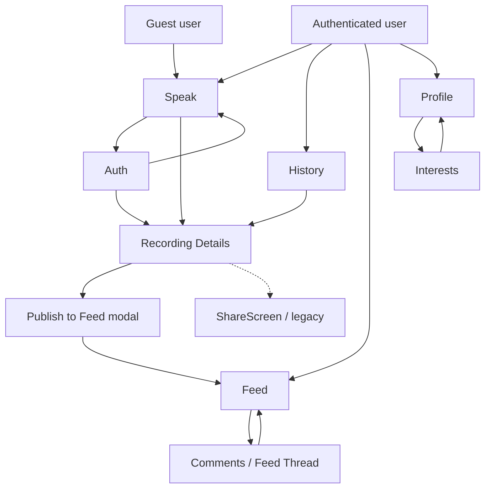
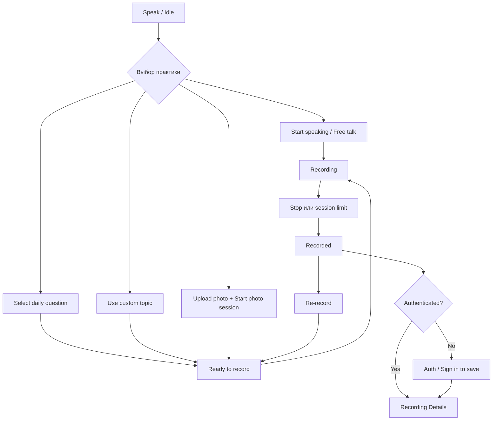
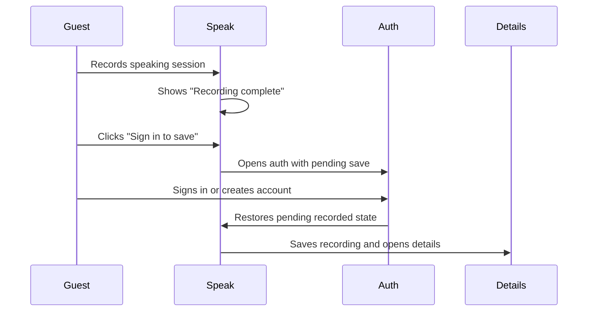
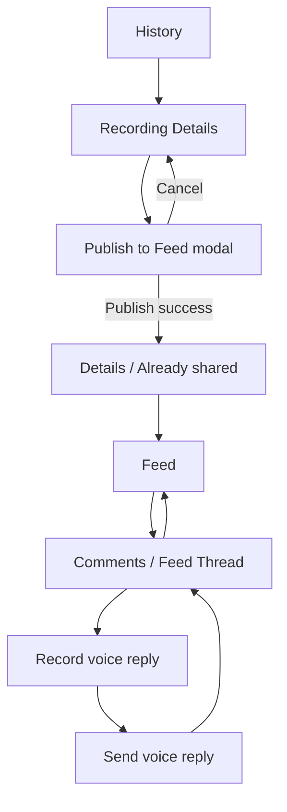
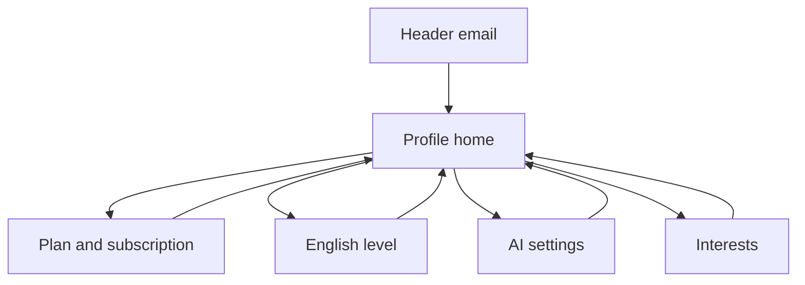

# Functional Requirements для дизайнера

Документ описывает текущую демку Daily Speaking Practice с точки зрения экранов, состояний и пользовательских переходов. Цель - дать дизайнеру понятную структуру того, что нужно отрисовать, без погружения в backend-реализацию.

## 1. Обзор продукта

Daily Speaking Practice - веб-приложение для ежедневной практики английской устной речи. Пользователь выбирает формат практики, записывает голос, сохраняет запись, получает транскрипт и AI-рекомендации, а затем может опубликовать запись в общий Feed и получить голосовые комментарии от других пользователей.

Ключевая пользовательская цель: быстро начать разговорную практику, сохранить результат и вернуться к прогрессу позже.

Основные продуктовые блоки:

- **Practice**: ежедневные вопросы, свободная речь, кастомная тема, описание фото, слова для изучения.
- **Recording**: запись голоса, лимиты по длительности, сохранение после авторизации.
- **Review**: история записей, аудио-плеер, транскрипт, подсветка ошибок, AI suggestions.
- **Community**: публикация записи в Feed, реакции, голосовые комментарии.
- **Profile**: интересы, уровень английского, подписка, AI-настройки.

## 2. Роли и режимы пользователя

### Гость

- Видит основной экран `Speak`.
- Может начать запись и пройти practice-flow до состояния "Recording complete".
- Не может сохранить запись без авторизации.
- При попытке сохранить попадает на `Auth` в режиме "Sign in to save recording".
- Не видит вкладки `History` и `Feed`.

### Авторизованный Free user

- Видит вкладки `Speak`, `History`, `Feed`.
- Может сохранять записи, смотреть историю, публиковать записи, оставлять voice replies.
- Имеет недельный лимит записи: 10 минут в неделю.
- Имеет лимит одной сессии: до 10 минут.
- Видит в профиле оставшееся время.

### Subscriber

- Имеет доступ к тем же экранам, что и Free user.
- Не ограничен недельным лимитом, но одна сессия все равно ограничена 10 минутами.
- В профиле видит статус подписки и дату окончания.

## 3. Глобальная навигация

Приложение работает как SPA внутри одного URL. Переходы между экранами управляются состоянием `currentScreen`, а не отдельными browser routes.

Покрытые screen states из текущей демки: `speak`, `history`, `feed`, `feedThread`, `details`, `share`, `auth`, `profile`, `interests`.

Глобальные элементы:

- Header с названием `Daily Speaking`.
- Вкладка `Speak` доступна всем.
- Вкладки `History` и `Feed` доступны только авторизованным пользователям.
- Для гостя справа отображается кнопка `Sign in / Register`.
- Для авторизованного пользователя справа отображаются email и кнопка `Log out`.
- Клик по email открывает `Profile`.

Правила навигации:

- При logout пользователь возвращается на `Speak`, а приватные данные и вкладки скрываются.
- При входе после попытки сохранить запись приложение возвращает пользователя к сохранению записи.
- Back-кнопки внутри деталей, комментариев и профиля возвращают в соответствующий родительский экран.

## 4. Карта экранов

## 5. Каталог экранов

### 5.1 Speak

Назначение: стартовая точка практики. Пользователь выбирает формат, получает подсказки, записывает голос и сохраняет результат.

Состояния, которые нужно отрисовать:

- **Idle / Start a new speaking session**
  - Hero-блок `Daily practice`.
  - Primary action `Start speaking` для free talk.
  - Блок `Today's questions`: 3 daily questions, loading skeleton, empty state, error state, кнопка regenerate.
  - Блок `Photo description`: upload photo, preview, remove photo, optional object name, start photo session, validation errors.
  - Блок `Words for study`: generate/regenerate 10 words, context text, highlighted study words, loading/empty/error states.
  - Блок `Custom topic`: collapsed/expanded input, cancel, use this topic.
  - Quota notice или ошибка лимита.

- **Ready to record**
  - Back to questions.
  - Выбранная тема или photo session title.
  - Primary action `Start speaking`.
  - Для topic/custom topic: `Topic guidance` с follow-up questions и useful words в раскрывающихся секциях.
  - Для photo description: preview фото и фиксированные подсказки, что описывать.
  - Loading/error state для генерации guidance.

- **Recording**
  - Recording indicator.
  - Название темы или `Free talk`.
  - Таймер.
  - Stop button.
  - Для авторизованных пользователей: отображение session limit.
  - Для topic practice: список вопросов может оставаться видимым.
  - Для photo practice: фото остается видимым во время записи.

- **Recorded**
  - Banner `Recording complete` или `Photo session complete`.
  - Duration.
  - Для гостя: notice, что сохранение доступно после входа.
  - Actions: `Re-record`, `Save and continue` или `Sign in to save`.
  - Preparing audio state.
  - Save error state.
  - Quota warning for free users.

### 5.2 Auth

Назначение: вход и регистрация.

Состояния:

- Обычный вход: title `Sign in / Register`.
- Вход после записи: title `Sign in to save recording`.
- Поля email и password.
- Actions: `Back`, `Sign in`, `Create account`.
- Loading state: `Please wait...`.
- Error state для неверных данных, короткого пароля, сетевой ошибки.

Особенность flow: если пользователь пришел сюда после записи и успешно вошел, запись автоматически сохраняется.

### 5.3 History

Назначение: список сохраненных записей пользователя.

Состояния:

- Список последних записей, если дата не выбрана.
- Date filter через календарь.
- Selected date state.
- Empty state: нет записей за выбранный день.
- Calendar states: visible/hidden, previous/next month, days with recordings, selected day.

Карточка записи должна показывать:

- время записи;
- тему;
- тип практики: `Free talk`, `Topic`, `Photo description`;
- длительность;
- thumbnail фото, если запись была photo practice.

Переход: клик по карточке открывает `Recording Details`.

### 5.4 Recording Details

Назначение: просмотр результата сохраненной записи.

Состояния:

- Recording found.
- Recording not found.
- Audio available/unavailable.
- Playback: play/pause, progress, seek, current time / duration.
- Playback error.
- Transcript ready/in progress.
- AI Suggestions ready/in progress.
- Recording already shared to Feed.
- Recording not shared yet.
- Feed comments loading/empty/error.

Контент:

- Back to History.
- Photo preview и object caption для photo practice.
- Metadata: duration, topic, practice type.
- Player.
- Transcript с подсветкой ошибочных фрагментов.
- AI Suggestions: wrong phrase, corrected phrase, explanation.
- Если запись уже опубликована: notice `Already shared to Feed`, список voice comments.
- Если запись еще не опубликована: primary action `Publish to Feed` и modal confirmation.

### 5.5 Publish to Feed modal

Назначение: подтверждение публикации записи в общий Feed.

Состояния:

- Open modal.
- Publishing loading state.
- Publish error.
- Close by Cancel.
- Close by backdrop, если публикация не идет.

Контент:

- Title `Publish To Feed`.
- Текст предупреждения, что запись станет доступна всем авторизованным пользователям.
- Actions: `Cancel`, `Publish`.

После успешной публикации:

- modal закрывается;
- запись считается опубликованной;
- пользователь видит notice `Recording published to Feed.`;
- опубликованный пост появляется в `Feed`.

### 5.6 Feed

Назначение: общий список опубликованных записей.

Состояния:

- Loading initial feed.
- Empty feed.
- Feed error.
- Reaction update loading/error.
- Transcript collapsed/expanded.

Карточка Feed post:

- topic;
- audio player;
- duration;
- action `Show text` / `Hide text`;
- action `Comments (N)`;
- reaction bar с вариантами: like, love, fire, laugh, support;
- transcript accordion.

Переходы:

- `Refresh` обновляет список.
- `Comments (N)` открывает `Comments / Feed Thread`.

### 5.7 Comments / Feed Thread

Назначение: отдельный thread опубликованной записи с голосовыми комментариями.

Состояния:

- Thread loading.
- Thread error.
- Original post transcript collapsed/expanded.
- No replies yet.
- Replies list.
- Reply recording idle.
- Reply recording in progress.
- Reply recorded and previewable.
- Sending reply.
- Reply quota reached.
- Reply/recording error.
- Reaction loading/error.

Контент:

- Back to Feed.
- Original post: topic, audio, duration, transcript toggle, reaction bar.
- `Voice Replies`: список replies с author masked email, duration, audio, reactions.
- `Your Voice Reply`: recorder controls.
- Actions: `Start recording`, `Stop`, `Re-record`, `Send voice reply`.

### 5.8 Profile

Назначение: управление аккаунтом и персонализацией.

Profile имеет внутренние подэкраны, но остается экраном `profile`.

#### Profile home

- Email пользователя.
- Menu items:
  - `План и подписка`;
  - `Уровень английского`;
  - `AI настройки`;
  - `Мои интересы`.
- Каждый пункт показывает краткий subtitle.

#### План и подписка

Состояния:

- Free plan: лимит 10 минут в неделю, used/left.
- Subscriber: unlimited per week, max 10 минут per session.
- Active subscription.
- Cancelled but active until date.
- Loading action.
- Error state.

Actions:

- `Оформить на месяц`;
- `Продлить на месяц`;
- `Отменить подписку`.

#### Уровень английского

Состояния:

- Current level.
- Editable select.
- Save enabled/disabled.
- Saving state.
- Error state.

Action: `Сохранить уровень`.

#### AI настройки

Состояния:

- Ollama model select.
- Loading available models.
- Save enabled/disabled.
- Refresh models.
- Error state.

Actions:

- `Обновить модели`;
- `Сохранить модель`.

### 5.9 Interests

Назначение: выбор интересов для персонализации вопросов, guidance и study words.

Состояния:

- Grid/list of interest chips.
- Selected chip.
- Disabled unselected chips when selected count reaches 10.
- Auto-saving after selection changes.
- Saving notice.
- Save error.

Правила:

- Максимум 10 интересов.
- Back возвращает в `Profile`.
- Изменение интересов сбрасывает устаревшие guidance/study results.

### 5.10 ShareScreen

Экран `share` существует в коде как `ShareScreen`, но в текущем активном UI-flow не используется: переход `openSharePreview` не вызывается компонентами. Для текущей дизайн-задачи его не нужно отрисовывать как обязательный экран.

Если flow будет возвращен, экран должен показывать read-only preview записи:

- Back to History.
- Metadata.
- Disabled player.
- Transcript.
- AI Suggestions.
- Photo preview для photo practice.

## 6. Основные пользовательские flow

### 6.1 Speaking practice flow

### 6.2 Save-after-auth flow

### 6.3 History, details, publish, feed flow

### 6.4 Profile and settings flow

## 7. Edge states, которые нужно учесть в дизайне

- Loading: генерация daily questions, topic guidance, study words, feed, thread, comments, model list, auth, save/publish/reply actions.
- Empty: нет daily questions, нет study words, нет записей, нет feed posts, нет replies, transcript/suggestions еще не готовы.
- Errors: auth error, microphone error, recording processing error, save error, publish error, feed/thread/reply/reaction error, Ollama/model error, photo validation error.
- Quota: free weekly limit reached, reply recording unavailable, session limit reached.
- Media unavailable: audio is unavailable, transcript is unavailable/in progress, AI suggestions in progress.
- Permission/browser issues: microphone unsupported, browser blocked recording/playback.
- Auth visibility: приватные экраны недоступны гостю.

## 8. Designer deliverables checklist

Минимальный набор макетов:

- Desktop и mobile layout для глобального shell/header.
- `Speak` во всех 4 состояниях: idle, ready, recording, recorded.
- `Auth` в обычном режиме и в режиме save-after-auth.
- `History` со списком, календарем и empty state.
- `Recording Details` для topic practice и photo practice.
- `Publish to Feed` modal.
- `Feed` со списком постов, transcript expanded/collapsed, reactions.
- `Comments / Feed Thread` с replies и reply recorder.
- `Profile home`, subscription, English level, AI settings.
- `Interests` с selected/disabled/saving/error states.

Компоненты/паттерны, которые должны быть переиспользуемыми:

- primary/secondary buttons;
- small buttons;
- back button;
- notice и error banners;
- audio player;
- progress bar;
- empty state;
- loading skeleton;
- modal;
- chip/tag;
- reaction bar;
- calendar day cell;
- recording/feed card.

Важно для дизайна:

- Продукт должен ощущаться как рабочий инструмент для регулярной практики, а не как landing page.
- Первый экран должен сразу давать возможность начать speaking session.
- Состояния лимитов и ошибок должны быть заметными, но не ломать основной flow.
- Mobile layout должен сохранять доступность recorder controls, особенно во время записи.
- Feed и History должны быть удобны для сканирования повторяющихся карточек.
